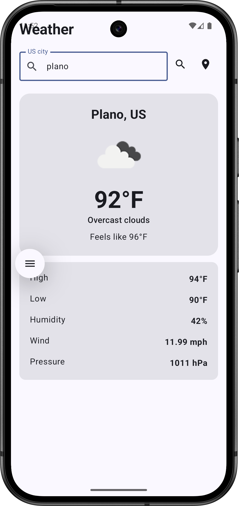
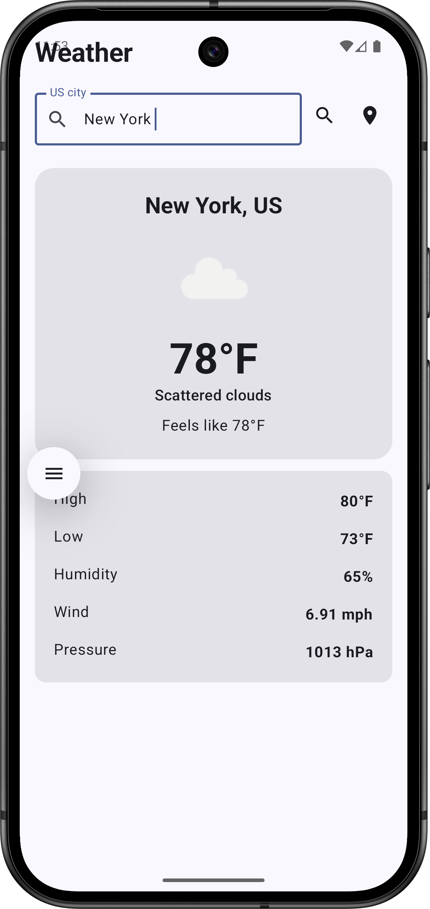
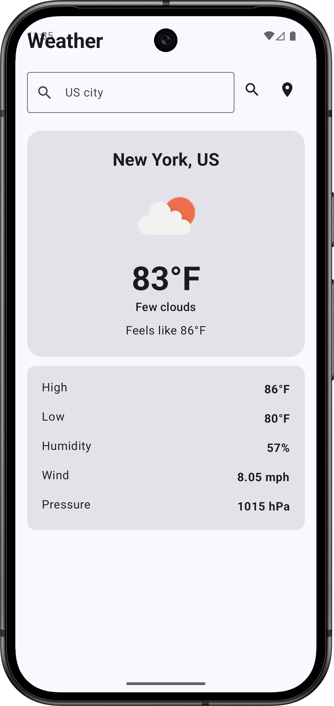

# Weather Android App

A native Android weather application built using Kotlin and MVVM Android architecture.

## Features
- Display weather info of last search city if current location not available to permission to access device location is OFF.
- Search weather by US city
- Automatic current location weather
- Location permission handling
- Last searched city persistence
- OpenWeatherMap integration
- Weather icons
- Loading states
- Error handling
- Retry
- Defensive input validation
- Image caching
- Unit tests
- Jetpack Compose UI

## Architecture

The application follows MVVM with a Repository and Use Case layer.

Compose UI -> ViewModel -> Use Cases -> Repository -> Remote / Local Data Sources


## Technologies

- Kotlin
- Used KSP instead for KAPT
- Jetpack Compose (UI)
- MVVM (Architecture)
- Retrofit (Network call)
- OkHttp (HTTP Client for Retrofit)
- Kotlin Coroutines (Async)
- Flow / StateFlow
- Hilt (Dependency Injection)
- DataStore (Local Data Storage)
- Coil (Image loading)
- Jetpack Navigation
- JUnit (Testing)
- Mockito (Testing)

## OpenWeatherMap API

The application uses:

Current Weather API:

https://api.openweathermap.org/data/2.5/weather

Geocoding API:

https://api.openweathermap.org/geo/1.0/direct

City names are converted to coordinates through the OpenWeather Geocoding API before requesting weather.

## API Key

Create:

```local.properties```

and add:

```OPEN_WEATHER_API_KEY=YOUR_API_KEY```

**NOTE: Do not commit local.properties.**

## Build

Open the project in Android Studio.

Sync Gradle.

Run:

```./gradlew test```

Then:

```./gradlew assembleDebug```

## Architecture Principles

- The UI does not directly communicate with Retrofit.
- The ViewModel does not contain networking code.
- The Repository abstracts data sources.
- DTOs are converted to domain models.
- Location is abstracted behind LocationProvider.
- DataStore is abstracted behind PreferencesDataSource.
- This makes the application easier to test and maintain.

## Screens




[](https://raw.githubusercontent.com/pritamworld/AndroidWeatherApp/main/data/sr1.webm)

# References

- [Current weather data](https://openweathermap.org/api/current?collection=current_forecast)
- [Geocoding API](https://openweathermap.org/api/geocoding-api?collection=other)
- [A Guide to OkHttp](https://www.baeldung.com/guide-to-okhttp)
- [Retrofit in Android](https://medium.com/@KaushalVasava/retrofit-in-android-5a28c8e988ce)
- [Build better apps faster with
  Jetpack Compose](https://developer.android.com/compose)
- [Android Hilt, Coroutines, MVVM Flow & Retrofit](https://medium.com/@nimit.raja/android-hilt-coroutines-mvvm-flow-retrofit-cb200434ecf6)
- [Building a Modern News App with MVVM, Retrofit, Hilt, Pagging and Jetpack Compose in Kotlin](https://mayursinhdevblog.hashnode.dev/building-a-modern-news-app-with-mvvm-retrofit-hilt-pagging-and-jetpack-compose-in-kotlin)
- [Mastering Android Unit Testing with Mockito: Mocking for Reliability and Flexibility](https://medium.com/@chetanshingare2991/mastering-android-unit-testing-with-mockito-mocking-for-reliability-and-flexibility-93d42078d2ca)
- [Kotlin flows on Android](https://developer.android.com/kotlin/flow)
- AI tool chatgpt.com to review and generate compose UI 